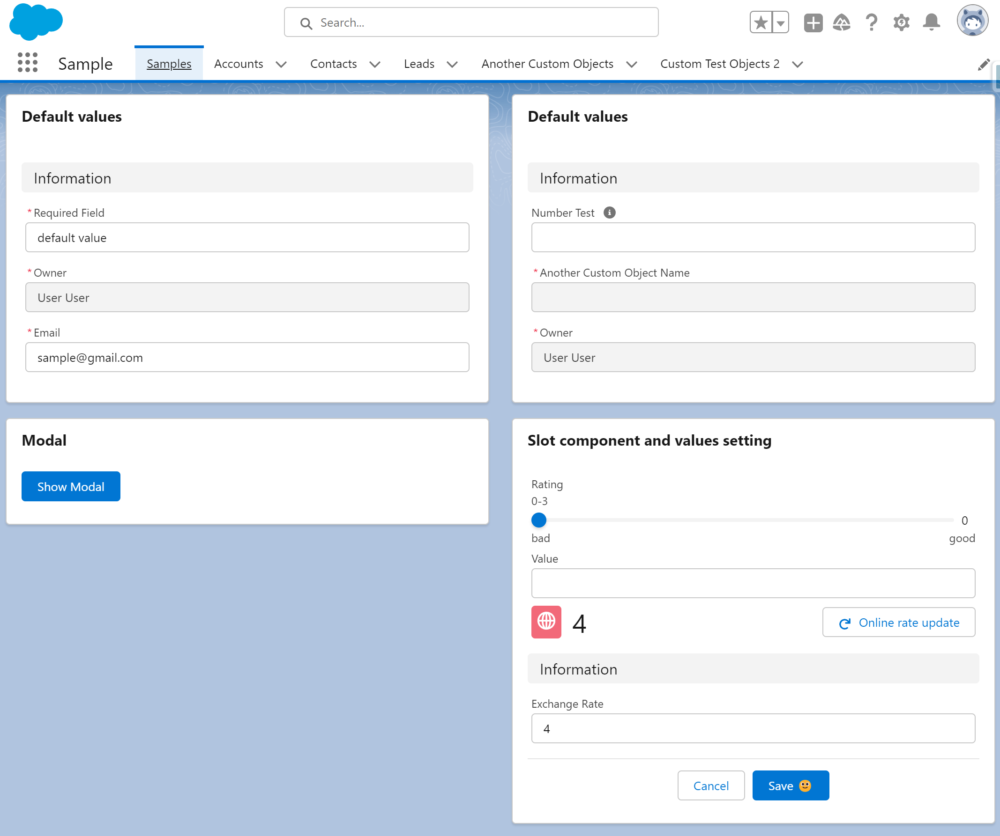

# LWC Dynamic Record Edit Form (Alpha)



## About

Generic LWC component to output a record creation form with all exposed fields. It uses native lightning-record-edit-form

## Features

-   Integrated on a single component (easy to copy to multiple projects)

## Notes

## Limitations

-   No record type description (only name)

## Instructions

### Use on your project

Everything was developed in a single LWC, so you just need a new single component on your project.

-   Copy the following files to your project:
    -   force-app/main/default/lwc/lwcDynamicRecordEditForm/\*\*
-   Call the component and pass the options

```
<c-lwc-dynamic-record-edit-form></c-lwc-dynamic-record-edit-form>
```

### Testing and learn how to use it

-   Run the `createorg.sh` to create a scratch org
-   Open the `Sample` lightning app
-   Explore the code on the `samples` component
-   Edit the page to preview on mobile devices or login with your mobile device (check the `password.env` file)

## References

https://developer.salesforce.com/docs/component-library/bundle/lightning-record-edit-form/documentation
